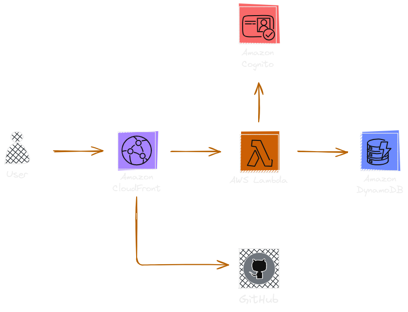
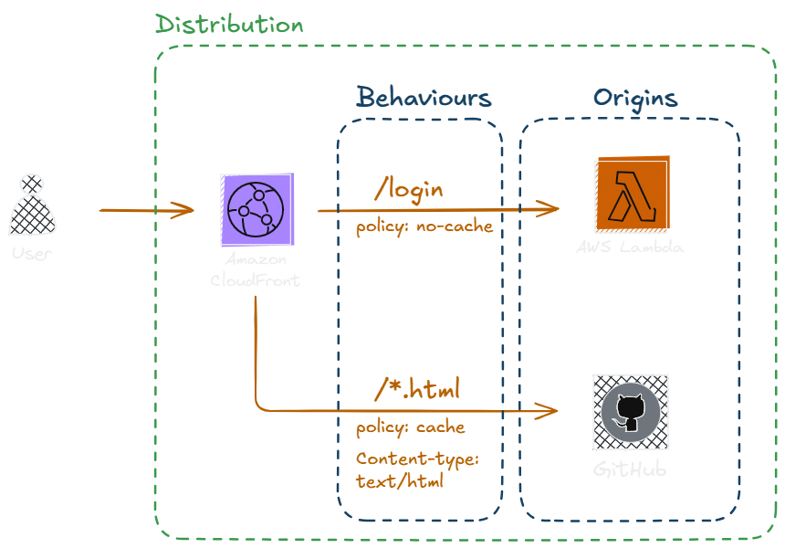
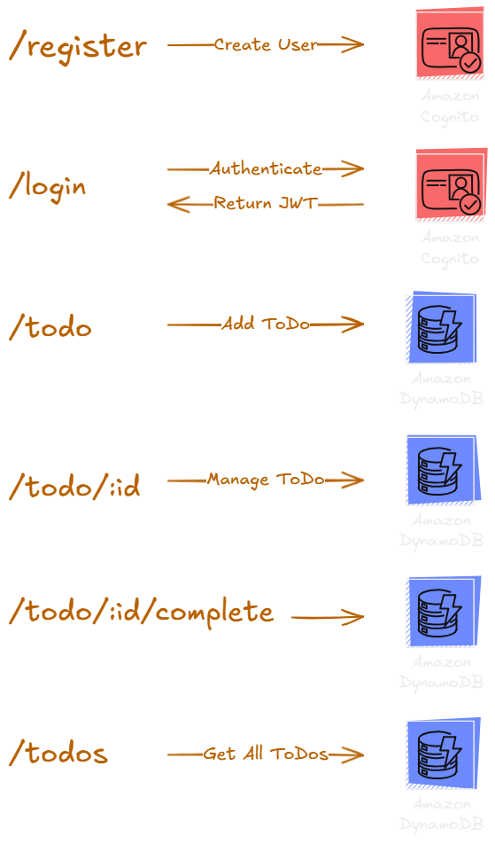

## This project deploys an AWS-based web application using AWS Always Free tier services only.

### The used components are

- AWS CloudFront - Application Frontend Reverse proxy and caching layer

- AWS Lambda - Backend Runtime

- AWS DynamoDB - Application Data Store

- AWS Cognito - User Management and Authentication



### CloudFront has two origins
- For serving the API calls from AWS Lambda
- For serving static content



The data from the static content origin is cached in CloudFront to ensure stable application performance

### [The backend](app/api/index.js) is nodejs-based

Backend API endpoints:<br>



### [The frontend](app/web) uses [Tailwind-CSS](https://tailwindcss.com/)

### The deployment is done with [terraform](https://www.terraform.io/)

### Deployment steps

- Download and install [terraform](https://developer.hashicorp.com/terraform/install)

- Download and install [npm](https://docs.npmjs.com/downloading-and-installing-node-js-and-npm)

- Clone the current project
```
git clone https://github.com/devopsundefined/todo.git
```

- Set credentials for your AWS project that terraform will use

MacOSX/Linux:
```
export AWS_ACCESS_KEY_ID=<aws_access_key>
export AWS_SECRET_ACCESS_KEY=<aws_secret_access_key>
export AWS_DEFAULT_REGION=<aws_region>
```

Windows:
```
set AWS_ACCESS_KEY_ID=<aws_access_key>
set AWS_SECRET_ACCESS_KEY=<aws_secret_access_key>
set AWS_DEFAULT_REGION=<aws_region>
```

- Install npm dependencies for the backend nodejs application
```
cd todo/app/api
npm install
```

- Go to the project root dir and initialize terraform

```
cd ../../
terraform init
```

- Do a terraform plan to see what will be deployed
```
terraform plan
```

- Apply the terraform code
```
terraform apply --auto-approve
```

- That's it! You can now access your newly deployed app using the the CloudFront distribution url

[You can also checkout the video tutorial for more details](https://youtu.be/mSM_nhP5ffo)

***Note:*** AWS Always free tier has some limitations in regards to the number of executed requests, used storage, etc. <br>It is always a good idea to set a [Billing alerting](https://docs.aws.amazon.com/AmazonCloudWatch/latest/monitoring/monitor_estimated_charges_with_cloudwatch.html) to track your AWS services usage. 